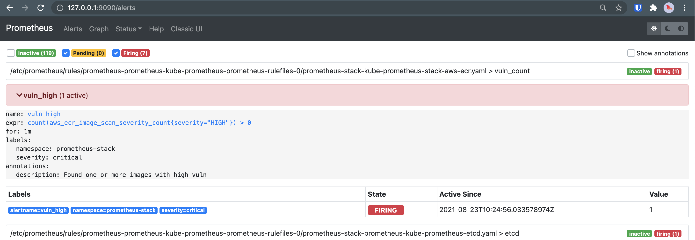
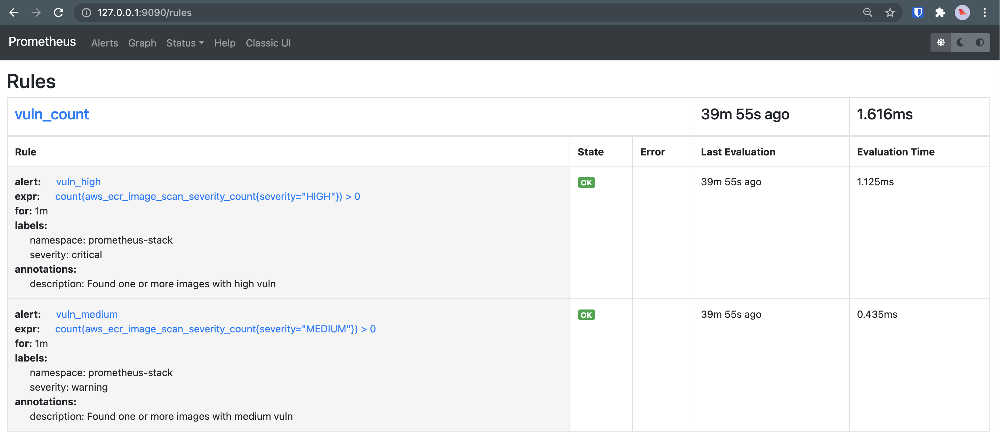

# Overview

При помощи Прометея хотим отслеживать количество уязвимых докер-образов в [ECR](https://aws.amazon.com/ru/ecr/).

Для этого используем один из кастомных экспортеров [aws-exporter](https://github.com/aws-exporters/ecr) (экспортер - это веб-сервер который получает json от амазона, преобразует в тип данных понятных прометей оператору(метрика) и отдает их по эндпоинту `/metrics`).

Создадим правило прометея, по которому будут срабатывать алерты и отправляться в телеграм. Используем [телеграм reciever](https://github.com/metalmatze/alertmanager-bot).

## Создаем AWS-ECR экспорте
!Note: Иногда требуется сначала запустить чарт prom-стэка 

В `/aws-ecr-exporter/deployment.yml` устанавливаем свои креденшиалы для AWS.
```
kubectl create namespace prometheus-stack
kubectl create -f aws-ecr-exporter
```
## Создаем телеграм receiver
!Note: что-то не работает, нужно через docker-compose :)

Создаем неймспейс и секреты.
```bash
kubectl create namespace monitoring
kubens monitoring
kubectl create secret generic admin --from-literal=alertmanager-bot='123456'
kubectl create secret generic token --from-literal=alertmanager-bot='1840871954:AAHvZmjCSiNS2KAH_0DYFlrf_PAfNyroBmc'
```
Смотрим секреты и вставляем закодированную часть в манифесты.
```bash
 kubectl get secret admin -o yaml | grep alert
  alertmanager-bot: 123123546
kubectl get secret token -o yaml | grep alert
  alertmanager-bot: MTg0MDg3MTk1NDpBQUh2Wm1qQ1NpTlMyS0FIXzBEWUZscmZfUEFmTnlyb0JtYw==
```
Создаем телеграм ресивера:
```bash
kubectl create -f tg-receiver
```
Либо можно поднять через `docker-compose up -d`


## Устанавливаем пром стэк
```bash
helm install prometheus prometheus-community/kube-prometheus-stack --namespace prometheus-stack --values=ecr_rule_alert.yaml
```
## После установки проверяем:
```
kubectl port-forward service/prometheus-stack-kube-prom-prometheus 9090:9090 --namespace prometheus-stack
```



